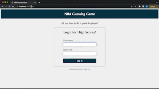
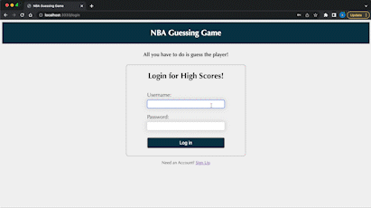
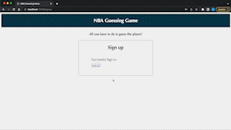
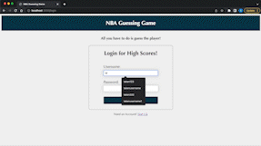

# NBA Guessing Game
An addictive game that allows users to guess NBA players' names in 8 tries. With every failed guess, additional hints would be provided.<br />
Users can login to keep track of high scores and previous guesses.<br />
Custom JWT middleware and cookie handling for built-from-scratch user authentication and session handling. Clean UI for the front end with layered protection on routes and user navigation using custom hooks, Axios interceptors nad react routes.


## Tech Stack


## Demo
[Demo video](https://drive.google.com/file/d/1Ioj0fkdWz9tep1w9jG5Yvbg31coIOaT8/view?usp=sharing)


## Component Details
### Sign-Up
Users need to sign up for account before login to access user records.
Full functionality sign up for with input validation and backend sign-up validation.



### Login
Users can log in to access previous user guesses and high scores.
Login input and backend validation implemented with protected routes



### Main Game
Once logged in, users have 8 tries to guess a random player.
Users can view a blacked-out mugshot of the player as a hint. After every guess, hints will be provided based on how close your guess is to the correct player.



### User Progress Retention
Users can sign out at any time and current progress will be stored.
Previous guesses would be rendered if users sign out before guessing the right answers




## Installation & Use
1. Clone the repo
    ```
    git clone https://github.com/andylin1212/CrashCourse.git](https://github.com/andylin1212/NBA-guessing-game.git
    ```
2. Install all required packages in both client and server folders
    ```
    npm install
    ```
3. Create a .env file in the server folder

4. Compile the client-side code
   ```
   npm run client-dev
   ```
5. Start the server
   ```
   npm run server-dev
   ```
6. Sign up, log in and guess away
